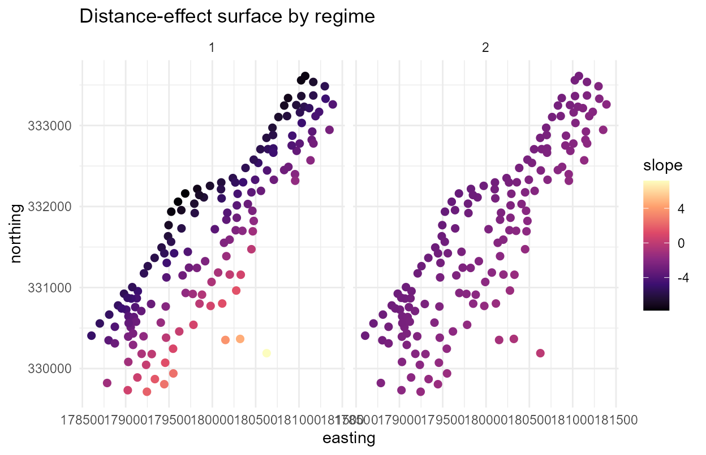

# Mixtures and spatially varying effects (gate and slope surfaces)

``` r
library(spmixqr)
set.seed(1)
```

This primer is for a researcher who has spatial data and a
distributional question but no prior exposure to spatial quantile
mixtures. It walks from the question to a reproducible report, using a
built-in version of the Meuse river soil dataset.

## 1. The question

Soil zinc near the river Meuse is contaminated unevenly. Two questions a
mean regression cannot answer:

- How does a **quantile** of contamination (here the median, though any
  `tau` works, including the upper tail) respond to distance from the
  river, and does that response **change across the flood plain**?
- Are there latent **regimes**, patches that behave like a different
  contamination process, and where are they?

`spmixqr` answers both at once. It splits the area into latent regimes
whose membership drifts smoothly over space, fits a quantile regression
in each, and lets each regime’s covariate effect be a spatial surface.

## 2. The model in one page

For a chosen quantile level $`\tau`$ (say the 0.9 upper tail), each
observation belongs to one of $`G`$ latent regimes. The probability of
regime $`k`$ at location $`s`$ is a smooth spatial surface, a softmax of
a spatial basis (the *gate*). Within regime $`k`$, the $`\tau`$-th
conditional quantile of the response is a linear predictor whose slopes
vary over space:
``` math
 Q_\tau(y \mid \text{regime }k, x, s) = \beta_{k0} + \sum_{j} x_j\,\beta_{kj}(s). 
```
The intercept $`\beta_{k0}`$ is a scalar. Spatial level variation is
carried by the gate, since a free spatial intercept surface is not
separately identified from it. Estimation is a penalised EM that reuses
the `mixqr` quantile-regression core (Wu and Yao 2016) for the
components and a spatially penalised multinomial-logit gate (Fernández
and Green 2002; Beraha et al. 2021). The component step uses a
convolution-smoothed check loss (Fernandes, Guerre, and Horta 2021; Tan,
Wang, and Zhou 2022) so a roughness penalty can be applied. The
single-regime case is a penalised spatially-varying-coefficient quantile
regression in the lineage of Reich, Fuentes, and Dunson (2011).

## 3. The data

``` r
data(meuse_zinc)
meuse_zinc$lzinc <- log(meuse_zinc$zinc)
str(meuse_zinc)
#> 'data.frame':    155 obs. of  7 variables:
#>  $ zinc : int  1022 1141 640 257 269 281 346 406 347 183 ...
#>  $ dist : num  0.00136 0.01222 0.10303 0.19009 0.27709 ...
#>  $ elev : num  7.91 6.98 7.8 7.66 7.48 ...
#>  $ ffreq: Factor w/ 3 levels "1","2","3": 1 1 1 1 1 1 1 1 1 1 ...
#>  $ x    : int  181072 181025 181165 181298 181307 181390 181165 181027 181060 181232 ...
#>  $ y    : int  333611 333558 333537 333484 333330 333260 333370 333363 333231 333168 ...
#>  $ lzinc: num  6.93 7.04 6.46 5.55 5.59 ...
```

`lzinc` is log zinc (ppm); `dist` is normalised distance to the river;
`x`, `y` are coordinates. Zinc is right-skewed and decays with distance,
but the *rate* of decay plausibly differs across the plain.

## 4. Fitting your first model

We model the conditional median ($`\tau = 0.5`$) of log zinc as a
function of distance, with two spatial regimes. Refit with `tau = 0.9`
to study the upper tail.

``` r
fit <- spmixqr(lzinc ~ dist, data = meuse_zinc, coords = c("x", "y"),
               G = 2, tau = 0.5, variance = "sandwich",
               control = spmixqr_control(nstart = 5L, k = 15L, seed = 1))
#> Warning in spmixqr(lzinc ~ dist, data = meuse_zinc, coords = c("x", "y"), :
#> slope surfaces cross at 26% of locations: a single global label is only
#> approximately coherent (see ?spmixqr Details).
fit
#> Spatial mixture of quantile regressions (spmixqr)
#>   G = 2 regimes,  tau = 0.5,  method = ald
#>   spatial gate: TRUE   spatial slopes: TRUE   basis: tp (r=14)
#> 
#> Constant component coefficients (intercept + average slopes):
#>             regime1 regime2
#> (Intercept)  6.9016  6.0256
#> dist        -3.4542 -2.3316
#> 
#>   logLik = -72.07   edf = 14.87   AIC = 173.9   BIC = 219.2
#>   note: slope surfaces cross at 26% of sites (label coherence approximate).
```

The fit reports a `label_stability` of about 0.26: the two regimes’
distance-effect surfaces cross at roughly a quarter of locations, so the
global “regime 1 / regime 2” labels are coherent across most, but not
all, of the plain. Section 9 returns to this; read the maps below with
that caveat in mind.

## 5. Interpreting the estimates

``` r
summary(fit)
#> Spatial mixture of quantile regressions (spmixqr)
#> G = 2,  tau = 0.5,  method = ald
#> 
#> -- Component regime1 (constant part) --
#>             Estimate Std. Error z value Pr(>|z|)    
#> (Intercept)  6.90158    0.05238  131.75   <2e-16 ***
#> dist        -3.45419    0.24171  -14.29   <2e-16 ***
#> ---
#> Signif. codes:  0 '***' 0.001 '**' 0.01 '*' 0.05 '.' 0.1 ' ' 1
#> 
#> -- Component regime2 (constant part) --
#>             Estimate Std. Error z value Pr(>|z|)    
#> (Intercept)   6.0256     0.1325  45.475  < 2e-16 ***
#> dist         -2.3316     0.4725  -4.935 8.03e-07 ***
#> ---
#> Signif. codes:  0 '***' 0.001 '**' 0.01 '*' 0.05 '.' 0.1 ' ' 1
#> 
#> -- Spatial gate (covariate log-odds vs regime1) --
#>    regime2 vs regime1:
#>             Estimate Std. Error z value Pr(>|z|)
#> (Intercept)   0.0830     0.1923   0.432    0.666
#> 
#> SE method: sandwich (classification-conditional; use variance='boot' for reporting)
#> logLik -72.07   edf 14.87   AIC 173.9   BIC 219.2
#> converged TRUE | starts 5 | gate cond 3462.0 | mean class entropy 0.26
#> label stability: slope surfaces cross at 26% of sites
```

Each regime has its own intercept (overall contamination level) and an
average distance slope. A steep negative slope means zinc falls quickly
away from the river; a flat slope means a regime where distance barely
matters (persistent contamination). The gate block reports any
gating-covariate effects; here the spatial field does the work, so read
the gate as a *map* (next section), not a coefficient.

## 6. Getting the uncertainty right

Two cautions are built in. The asymmetric-Laplace likelihood is a
*working* likelihood, and the sandwich standard errors above are
*classification-conditional*: they treat the regime labels as known, so
they tend to be optimistic. For reporting, prefer the spatial-block
bootstrap, which refits the whole pipeline and aligns labels across
replicates:

``` r
fit_boot <- spmixqr(lzinc ~ dist, data = meuse_zinc, coords = c("x", "y"),
                    G = 2, tau = 0.5, variance = "boot",
                    control = spmixqr_control(nstart = 5L, k = 15L, seed = 1,
                                              boot_B = 200L, boot_block = 3L))
```

## 7. The headline question, answered

Does the distance effect on the median vary across space? The slope
surface answers it directly.

``` r
cs <- coef_surface(fit, covariate = 1)
tapply(cs$slope, cs$regime, function(s) round(range(s), 2))
#> $`1`
#> [1] -7.80  7.18
#> 
#> $`2`
#> [1] -3.29 -0.14
```

A wide slope range means the distance effect is genuinely spatial within
that regime, not a single number.

## 8. Reading the fit in pictures

``` r
library(ggplot2)
theme_set(theme_minimal(base_size = 11))

gs <- gate_surface(fit)
ggplot(subset(gs, regime == "2"), aes(coord1, coord2, colour = prob)) +
  geom_point(size = 2) +
  scale_colour_viridis_c(limits = c(0, 1)) +
  labs(title = "Where regime 2 dominates", x = "easting", y = "northing",
       colour = "P(regime 2)")
```


``` r
ggplot(cs, aes(coord1, coord2, colour = slope)) +
  geom_point(size = 2) + facet_wrap(~ regime) +
  scale_colour_viridis_c(option = "magma") +
  labs(title = "Distance-effect surface by regime", x = "easting", y = "northing")
```



## 9. Diagnostics: can you trust it?

``` r
d <- fit$diagnostics
c(converged = d$converged, starts = d$n_starts,
  gate_cond = round(d$gate_cond, 1),
  class_entropy = round(d$class_entropy, 2),
  label_stability = round(d$label_stability, 2))
#>       converged          starts       gate_cond   class_entropy label_stability 
#>            1.00            5.00         3462.00            0.26            0.26
```

`class_entropy` near 0 means confident classification; near 1 means
overlapping regimes. `label_stability` is the fraction of locations
where the regime slope surfaces cross: a high value warns that a single
global label is only approximately coherent across space (a known v1
limitation). Here it sits near 0.26.

**A negative control.** When there is no spatial structure, the method
should report none. We simulate a constant gate and flat slopes, then
check that the gate surface stays flat:

``` r
nc <- sim_spmixqr(n = 200, gate_slope = 0, coef_slope = 0, seed = 7)
fit_nc <- spmixqr(y ~ x, nc$data, coords = nc$coords, G = 2, tau = 0.5,
                  lambda_gate = 10, lambda_coef = 10, variance = "none",
                  control = spmixqr_control(nstart = 4L, seed = 1))
g_nc <- gate_surface(fit_nc)
round(sd(g_nc$prob[g_nc$regime == "2"]), 3)   # small => no manufactured structure
#> [1] 0.058
```

## 10. Practical guidance and pitfalls

- **Keep `G` small** (2–3). Spatial mixtures are data-hungry, and label
  coherence degrades as regimes proliferate.
- **Standardise coordinates.** This is handled internally, but supply
  coordinates on a sensible common scale.
- **Choose the smoothing** with
  [`spmixqr_select()`](https://kvenkita.github.io/spmixqr/reference/spmixqr_select.md)
  (BIC or cross-validated check loss) rather than guessing
  `lambda_gate`/`lambda_coef`.
- **Report bootstrap intervals**, not the sandwich, for inference.
- Watch the `label_stability` warning: crossing slope surfaces mean the
  regime identities are not globally fixed.

## 11. How `spmixqr` relates to other tools

`quantreg` fits one quantile regression with no spatial structure;
`mixqr` adds latent regimes but fixed mixing; `mixqrgate` lets mixing
depend on covariates. `spmixqr` makes the mixing *spatial* and the
component effects *spatial surfaces*. No maintained R package fits
spatial quantile regression (`BSquare` and `McSpatial` are archived), so
the single-regime case fills that gap too (Reich, Fuentes, and Dunson
2011).

## 12. Reporting and reproducibility

``` r
list(tau = fit$tau, G = fit$G,
     intercepts = round(fit$beta_const[1, ], 2),
     avg_slopes = round(fit$beta_const[2, ], 2),
     bic = round(fit$bic, 1))
#> $tau
#> [1] 0.5
#> 
#> $G
#> [1] 2
#> 
#> $intercepts
#> [1] 6.90 6.03
#> 
#> $avg_slopes
#> [1] -3.45 -2.33
#> 
#> $bic
#> [1] 219.2
```

A spatial quantile mixture turns “how does contamination respond to
distance” into a *map* of regime-specific tail responses. Through the
diagnostics and the negative control, it declines to invent structure
the data do not support.

## References

Beraha, Mario, Matteo Pegoraro, Riccardo Peli, and Alessandra Guglielmi.
2021. “Spatially Dependent Mixture Models via the Logistic Multivariate
CAR Prior.” *Spatial Statistics* 46: 100548.

Fernandes, Marcelo, Emmanuel Guerre, and Eduardo Horta. 2021. “Smoothing
Quantile Regressions.” *Journal of Business & Economic Statistics* 39
(1): 338–57. <https://doi.org/10.1080/07350015.2019.1660177>.

Fernández, Carmen, and Peter J. Green. 2002. “Modelling Spatially
Correlated Data via Mixtures: A Bayesian Approach.” *Journal of the
Royal Statistical Society, Series B* 64 (4): 805–26.

Reich, Brian J., Montserrat Fuentes, and David B. Dunson. 2011.
“Bayesian Spatial Quantile Regression.” *Journal of the American
Statistical Association* 106 (493): 6–20.
<https://doi.org/10.1198/jasa.2010.ap09237>.

Tan, Kean Ming, Lan Wang, and Wen-Xin Zhou. 2022. “High-Dimensional
Quantile Regression: Convolution Smoothing and Concave Regularization.”
*Journal of the Royal Statistical Society, Series B* 84 (1): 205–33.
<https://doi.org/10.1111/rssb.12485>.

Wu, Chih-Hao, and Weixin Yao. 2016. “Mixtures of Quantile Regressions.”
*Computational Statistics & Data Analysis* 93: 162–76.
<https://doi.org/10.1016/j.csda.2015.08.013>.
